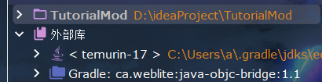

## 1.创建物品注册器

> 注册是指将模组中的对象（例如物品、方块、声音等）告知游戏的过程。注册至关重要，因为如果没有注册，游戏将无法识别这些对象，从而导致无法解释的行为和崩溃。

forge推荐我们使用`DeferredRegister` 来注册对象，它既能保留静态初始化器的便利性，又能避免其带来的问题。`DeferredRegister` 维护一个条目的提供者列表，并在 `RegisterEvent` 期间从这些提供者处注册对象。

我们在src/main/java/org/nothink/tutorial_mod/下新建一个init文件夹，这个专门用于所有实例的注册。在init文件夹中创建ModItems类，专门用于物品的注册。

下面代码展示了如何创建物品注册器

```java
public class ModItems {
    //创建物品注册器
    public static final DeferredRegister<Item> ITEMS = DeferredRegister.create(ForgeRegistries.ITEMS, Tutoriamod.MOD_ID);
  
}


```

create方法第一个参数是注册类型，这里就是ITEMS物品类型，第二个参数是模组ID。

这样我们就创建好了模组注册器。

## 2.使用注册器注册物品

调用register方法，注册我们的物品

```java
public class ModItems {
    //创建物品注册器
    public static final DeferredRegister<Item> ITEMS = DeferredRegister.create(ForgeRegistries.ITEMS, Tutoriamod.MOD_ID);
    //进行物品的注册
    public static final RegistryObject<Item> EXAMPLE_ITEM = ITEMS.register("example_item", () -> new Item(new Item.Properties()));

}
```

register方法有两个参数，第一个是物品的**注册名**(注册完成后物品完整的名字是`tutoria_mod:example_item`)，第二个是一个Supplier类型，用于定义物品的属性。（Supplier点进去可以看到是一个函数式接口，因此可以简化成lambda形式）。

## 3.将注册器加载到MOD总线上

现在我们已经有了注册器，并且告诉注册器要注册的物品，现在我们需要把注册器登记在MOD总线上，让Forge去运行我们的注册器。

这里我们定义一个register方法

```java
public class ModItems {
    //创建物品注册器
    public static final DeferredRegister<Item> ITEMS = DeferredRegister.create(ForgeRegistries.ITEMS, Tutoriamod.MOD_ID);
    //进行物品的注册
    public static final RegistryObject<Item> EXAMPLE_ITEM = ITEMS.register("example_item", () -> new Item(new Item.Properties()));


    //用于在主类登记注册器
    public static void register(IEventBus bus) {
        ITEMS.register(bus);
    }
}

```

然后在主类登记注册器

```java
@Mod(Tutoriamod.MOD_ID)
public class Tutorialmod {

    // Define mod id in a common place for everything to reference
    public static final String MOD_ID = "tutorial_mod";

    public Tutoriamod() {
        IEventBus modEventBus = FMLJavaModLoadingContext.get().getModEventBus();
        //region ModEventBus
        //进行物品注册器的登记
        ModItems.register(modEventBus);
        //end region

    }
}
```

到这里物品就已经在我们的世界中创建成功了。我们可以运行runClient进入游戏，输入指令`/give Dev tutoriamod:example_item`,就可以获得我们注册的物品了。

## 5.为物品提供Models和Textures

> [模型系统](https://minecraft.wiki/w/Tutorials/Models#File_path)是《我的世界》中赋予方块和物品形状的一种方式。通过模型系统，方块和物品被映射到它们的模型上，模型定义了它们的外观。模型系统的主要目标之一是允许资源包不仅改变方块/物品的纹理，还能改变其整个形状。实际上，任何添加物品或方块的模组都包含一个用于其方块和物品的小型资源包。

如果你成功获取到了注册的物品，你会发现物品的性质是我们非常熟悉无比的紫黑块（不出意外的情况下，以后我们会经常看到它，因为只要你看到了它，就代表出意外了xD）。因为我们并没有给物品设置模型(model)和纹理(texture)，游戏不知道这个物品长什么样子，所以我们来给物品添加上这些东西。

首先我们拓展src/main/resources目录，assets表示此目录用于放置静态资源(resource)，tutorial_mod是模组id，models用于放置模型文件，textures用于放置纹理文件，lang用于本地化（下一步详解）。在models/item目录下创建`xxx.json`这里的xxx对应我们的注册名，本例中就是`example_item.json`。在textures/item目录下创建`xxx.png`这里xxx也对应注册名。

```
assets
└── tutorial_mod
    |
    ├── models
    |   └── item
    |       └── example_item.json
    |
    ├── textures
    |   └── item
    |       └── example_item.png
    |
    └── lang
        └── en_us.json
           
```

`example_item.json`:

```json
{
  "parent": "item/generated",
  "textures": {
    "layer0": "tutorial_mod:item/example_item"
  }
}
```

这是实现基本物品模型的最小实现，下面是从wiki中翻译的对键的解释

**parent** ：加载另一个模型作为父模型，格式为资源定位符。

- 设为 `"item/generated"`：使用依靠贴图图层生成的物品模型（常规手持道具、工具、物品图标）。
- 设为 `"builtin/entity"`：加载实体专用内置模型。**无法指定具体实体**，仅适用于箱子、末影箱、生物头颅、盾牌、旗帜、三叉戟。

**textures** ：保存模型的纹理，值为资源定位符，也可以是另一个纹理变量。

## 1.创建物品注册器

> 注册是指将模组中的对象（例如物品、方块、声音等）告知游戏的过程。注册至关重要，因为如果没有注册，游戏将无法识别这些对象，从而导致无法解释的行为和崩溃。

forge推荐我们使用`DeferredRegister` 来注册对象，它既能保留静态初始化器的便利性，又能避免其带来的问题。`DeferredRegister` 维护一个条目的提供者列表，并在 `RegisterEvent` 期间从这些提供者处注册对象。

我们在src/main/java/org/nothink/tutorial_mod/下新建一个init文件夹，这个专门用于所有实例的注册。在init文件夹中创建ModItems类，专门用于物品的注册。

下面代码展示了如何创建物品注册器

```java
public class ModItems {
    //创建物品注册器
    public static final DeferredRegister<Item> ITEMS = DeferredRegister.create(ForgeRegistries.ITEMS, Tutoriamod.MOD_ID);
    }

```

create方法第一个参数是注册类型，这里就是ITEMS物品类型，第二个参数是模组ID。

这样我们就创建好了模组注册器。

## 2.使用注册器注册物品

调用register方法，注册我们的物品

```java
public class ModItems {
    //创建物品注册器
    public static final DeferredRegister<Item> ITEMS = DeferredRegister.create(ForgeRegistries.ITEMS, Tutoriamod.MOD_ID);
    //进行物品的注册
    public static final RegistryObject<Item> EXAMPLE_ITEM = ITEMS.register("example_item", () -> new Item(new Item.Properties()));
}
```

register方法有两个参数，第一个是物品的**注册名**(注册完成后物品完整的名字是`tutoria_mod:example_item`)，第二个是一个Supplier类型，用于定义物品的属性。（Supplier点进去可以看到是一个函数式接口，因此可以简化成lambda形式）。

## 3.将注册器加载到MOD总线上

现在我们已经有了注册器，并且告诉注册器要注册的物品，现在我们需要把注册器登记在MOD总线上，让Forge去运行我们的注册器。

这里我们定义一个register方法

```java
public class ModItems {
    //创建物品注册器
    public static final DeferredRegister<Item> ITEMS = DeferredRegister.create(ForgeRegistries.ITEMS, Tutoriamod.MOD_ID);
    //进行物品的注册
    public static final RegistryObject<Item> EXAMPLE_ITEM = ITEMS.register("example_item", () -> new Item(new Item.Properties()));


    //用于在主类登记注册器
    public static void register(IEventBus bus) {
        ITEMS.register(bus);
    }
}

```

然后在主类登记注册器

```java
@Mod(Tutoriamod.MOD_ID)
public class Tutorialmod {

    // Define mod id in a common place for everything to reference
    public static final String MOD_ID = "tutorial_mod";

    public Tutorialmod() {
        IEventBus modEventBus = FMLJavaModLoadingContext.get().getModEventBus();
        //region ModEventBus
        //进行物品注册器的登记
        ModItems.register(modEventBus);
        //end region

    }
}
```

到这里物品就已经在我们的世界中创建成功了。我们可以运行runClient进入游戏，输入指令`/give Dev tutoriamod:example_item`,就可以获得我们注册的物品了。

## 5.为物品提供Models和Textures

> [模型系统](https://minecraft.wiki/w/Tutorials/Models#File_path)是《我的世界》中赋予方块和物品形状的一种方式。通过模型系统，方块和物品被映射到它们的模型上，模型定义了它们的外观。模型系统的主要目标之一是允许资源包不仅改变方块/物品的纹理，还能改变其整个形状。实际上，任何添加物品或方块的模组都包含一个用于其方块和物品的小型资源包。

如果你成功获取到了注册的物品，你会发现物品的性质是我们非常熟悉无比的紫黑块（不出意外的情况下，以后我们会经常看到它，因为只要你看到了它，就代表出意外了xD）。因为我们并没有给物品设置模型(model)和纹理(texture)，游戏不知道这个物品长什么样子，所以我们来给物品添加上这些东西。

首先我们拓展src/main/resources目录，assets表示此目录用于放置静态资源(resource)，tutorial_mod是模组id，models用于放置模型文件，textures用于放置纹理文件，lang用于本地化（下一步详解）。在models/item目录下创建`xxx.json`这里的xxx对应我们的注册名，本例中就是`example_item.json`。在textures/item目录下创建`xxx.png`这里xxx也对应注册名。

```
assets
└── tutorial_mod
    |
    ├── models
    |   └── item
    |       └── example_item.json
    |
    ├── textures
    |   └── item
    |       └── example_item.png
    |
    └── lang
        └── en_us.json
           
```

`example_item.json`:

```json
{
  "parent": "item/generated",
  "textures": {
    "layer0": "tutorial_mod:item/example_item"
  }
}
```

这是实现基本物品模型的最小实现，下面是从wiki中翻译的对键的解释

**parent** ：加载另一个模型作为父模型，格式为资源定位符。

- 设为 `"item/generated"`：使用依靠贴图图层生成的物品模型（常规手持道具、工具、物品图标）。
- 设为 `"builtin/entity"`：加载实体专用内置模型。**无法指定具体实体**，仅适用于箱子、末影箱、生物头颅、盾牌、旗帜、三叉戟。

**textures** ：保存模型的纹理，值为资源定位符，也可以是另一个纹理变量。

**layer \*N\*** ：仅用于`item/generated`模型，定义物品栏显示贴图图层。图层数量由物品硬编码限定（layer0、layer1……）；

而而在textures/item目录下放置对应的纹理图片文件。如果你实在懒的画，可以先用原版纹理代替。在你的项目栏里找到外部库，在里面找到net.minecraft.client:extra:1.20.1。这是原版数据包和资源包存放的地方。这里我用铁的纹理进行替代。将纹理文件复制到对应目录下，改名为example_item.png



然后进入游戏，就会发现物品的形状已经发生了变化

## 6.进行本地化

如果我们把鼠标悬浮在物品上，会发现物品的名字是非常长的一串item.tutorialmod.example_item，这不是我们想要的，所以我们来给物品添加本地化。
还记得我们在lang目录下创建的en_us.json吗？

```json
 {
  "item.tutorial_mod.example_item": "Example Item"
}
```

如果你想添加其他语言的本地化，请在assets/tutorial_mod/lang目录下创建其他语言的json文件，例如zh_cn.json。

```json
 {
  "item.tutorial_mod.example_item": "示例物品"
 }
```

添加本地化后，当你进入游戏，鼠标悬浮在物品上，就会显示我们想要的名字。

##  注册大量物品的推荐写法
由于注册物品时一行太长，注册大量物品时未免显得混乱。对此，我们可以采用如下注册方式
```java
public class ModItems {
    public static final DeferredRegister<Item> ITEMS;
    public static final RegistryObject<Item> EXAMPLE_ITEM;

    static {
        ITEMS = DeferredRegister.create(ForgeRegistries.ITEMS, Tutorial_mod.MOD_ID);
        EXAMPLE_ITEM = ITEMS.register("example_item", () -> new Item(new Item.Properties()));

    }

    //用于在主类登记注册器
    public static void register(IEventBus bus) {
        ITEMS.register(bus);
    }
    
}

```